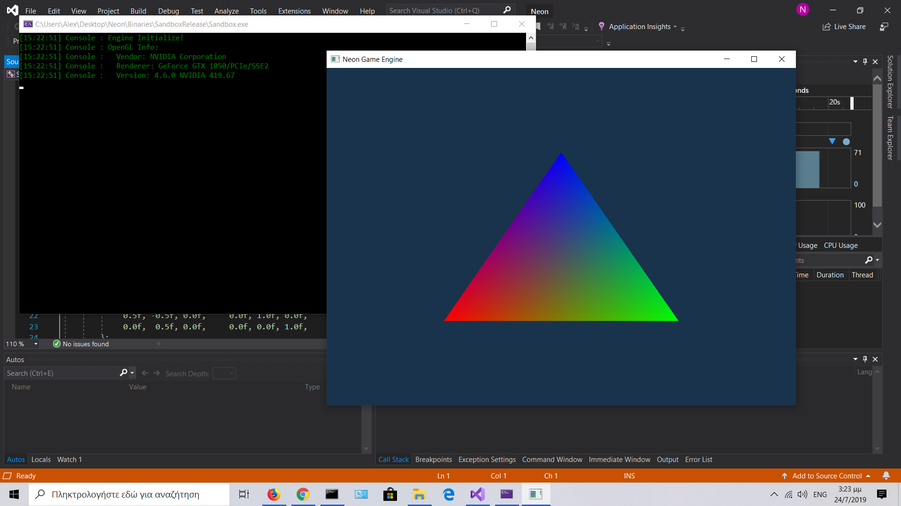

# Neon-Engine
The Neon Game Engine is an experimental project using OpenGL Rendering API.
It's goal is to create an easy to use Unity-like engine for the user.

The project is at an early development stage and there is a lot of work to be done.
Currently only basic 2D and 3D objects are suppported but model loading is planned for the future.
Also there is exprimental support for ECS (Entity Component System) which uses a Data Oriented Desing behind the scenes.

Current Progress:


Here is a sample program which outputs the above triangle:
``` 
#include <Neon.h>

using namespace Neon::Application;
using namespace Neon::Graphics;
using namespace Neon::Event;
using namespace Neon::Input;
using namespace Neon::World;

class MyApp : public Application
{
public:
	MyApp() : orthoCamera(-1.0f, 1.0f, -1.0f, 1.0f) {}

	void Start() override
	{
		std::vector<float> vertices = 
		{
			-0.5f, -0.5f, 0.0f,		1.0f, 0.0f, 0.0f,
			 0.5f, -0.5f, 0.0f,		0.0f, 1.0f, 0.0f,
			 0.0f,  0.5f, 0.0f,		0.0f, 0.0f, 1.0f,
		};

		std::vector<unsigned int> indices = 
		{
			0, 1, 2   
		};
		
		std::string vertPath = "Engine/Graphics/Shaders/BasicVertex.glsl";
		std::string fragPath = "Engine/Graphics/Shaders/BasicFrag.glsl";
		shader = Shader::Create(vertPath, fragPath);

		BufferLayout layout =
		{
			{ ShaderType::Float3, "inPos" },
			{ ShaderType::Float3, "inColor" }
		};
		
		vertexArray = VertexArray::Create();

		std::shared_ptr<VertexBuffer> vertex = VertexBuffer::Create(vertices);
		vertex->SetLayout(layout);

		std::shared_ptr<IndexBuffer> index = IndexBuffer::Create(indices);

		vertexArray->AddVertexBuffer(vertex);
		vertexArray->AddIndexBuffer(index);

		vertexArray->Unbind();
	}
	
	void OnUpdate() override
	{
		if (InputManager::GetKey(NEON_KEY_W))
		{
			m_OrthoPosition.y += 0.1f;
		}
		if (InputManager::GetKey(NEON_KEY_S))
		{
			m_OrthoPosition.y -= 0.1f;
		}
		if (InputManager::GetKey(NEON_KEY_A))
		{
			m_OrthoPosition.x -= 0.1f;
		}
		if (InputManager::GetKey(NEON_KEY_D))
		{
			m_OrthoPosition.x += 0.1f;
		}

		orthoCamera.SetPosition(m_OrthoPosition);
	}

	void OnRender() override
	{
		Renderer::StartScene(orthoCamera);

		DrawCommand::ClearBuffer(0.1f, 0.2f, 0.3f, 1.0f);
		Renderer::Submit(vertexArray, shader);
		
		Renderer::EndScene();
	}

	void Stop() override
	{
		
	}

private:
	std::shared_ptr<VertexArray> vertexArray;
	std::shared_ptr<Shader> shader;

	OrthoCamera orthoCamera;
	glm::vec3 m_OrthoPosition = glm::vec3(0.0f);

};

NEON_MAIN_APPLICATION(MyApp);
```
