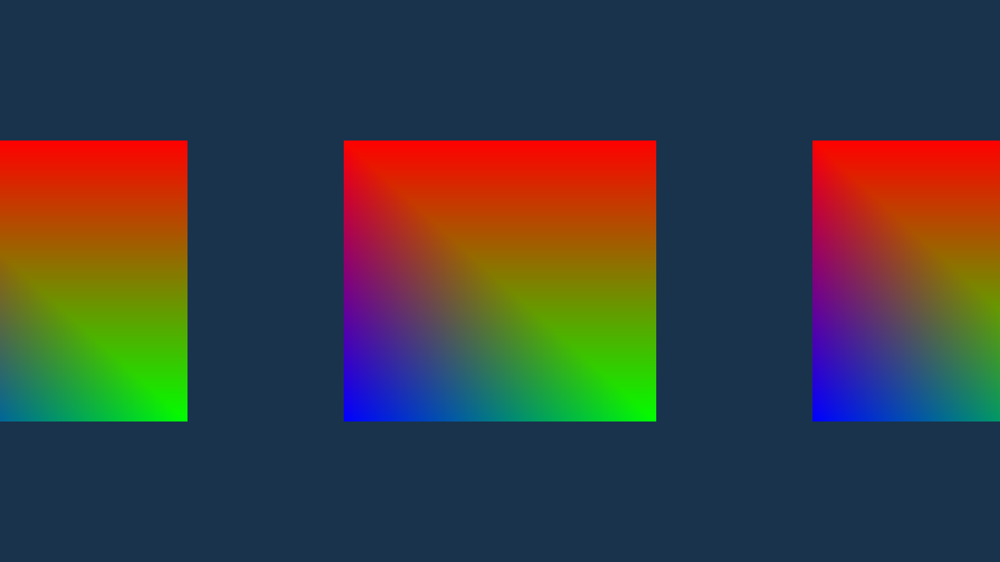

# Neon-Engine

The Neon Game Engine is an experimental project using OpenGL Rendering API.
It's goal is to create an easy to use engine for the user. It is mainly written
in C++ but scripting in Python is planned for the future. 

The project is at an early development stage and there is a lot of work to be done.
Currently only basic 2D and 3D objects are suppported but model loading is planned for the future.
Also there is paartial support for ECS (Entity Component System) which uses a Data Oriented Design
for improved performace and reliability.

# Current Progress:


# Sample Program
``` 
#include <Neon.h>

using namespace Neon;
using namespace Neon::World;
using namespace Neon::Component;

/* The game class. This is the place where the game code must be written */
class MyApp : public Neon::Application::Application
{
public:
	MyApp() : orthoCamera(-1.6f, 1.6f, -1.2f, 1.2f) {}

	/* This method gets called when the appliction is created.*/
	void Start() override
	{
		/* This is the array of vertices that make up the quad.*/
		/* NOTE: This is temporary and will be replaced by a Mesh component! */
		std::vector<float> vertices = 
		{
			 /* Positions			    Colors*/
			 0.5f,  0.5f, 0.0f,		1.0f, 0.0f, 0.0f,
			 0.5f, -0.5f, 0.0f,		0.0f, 1.0f, 0.0f,
			-0.5f, -0.5f, 0.0f,		0.0f, 0.0f, 1.0f,
			-0.5f,  0.5f, 0.0f,		1.0f, 0.0f, 0.0f
		};

		/* The indices used for indexed drawing */
		std::vector<unsigned int> indices = 
		{
			0, 1, 3,
			1, 2, 3
		};
		
		/* This is the creation of a basic set of shaders */
		/* NOTE: In the future shader files will be created at runtime! */
		std::string vertPath = "Engine/Graphics/Shaders/BasicVertex.glsl";
		std::string fragPath = "Engine/Graphics/Shaders/BasicFrag.glsl";
		shader = Graphics::Shader::Create(vertPath, fragPath);

		/* The buffer layout is neccessery and describes the layout of the vertices */
		Graphics::BufferLayout layout =
		{
			{ Graphics::ShaderType::Float3, "inPos" },
			{ Graphics::ShaderType::Float3, "inColor" }
		};
		
		/* Creation of a Vertex Array Object (OpenGL ONLY!) */
		vertexArray = Graphics::VertexArray::Create();

		std::shared_ptr<Graphics::VertexBuffer> vertex = Graphics::VertexBuffer::Create(vertices);
		vertex->SetLayout(layout);

		std::shared_ptr<Graphics::IndexBuffer> index = Graphics::IndexBuffer::Create(indices);

		/* Attaching to the VAO the vertex buffer and the index buffer */
		vertexArray->AddVertexBuffer(vertex);
		vertexArray->AddIndexBuffer(index);

		vertexArray->Unbind();

		/* Creating a new scene in the world */
		mSceneManager->CreateScene("Test");

		SceneRef mScene = mSceneManager->GetScene("Test");

		/* Creating a set of children nodes in the scenes root node */
		SceneNodeRef node1 = mScene->GetRootNode()->CreateChildNode("Quad1");
		SceneNodeRef node2 = mScene->GetRootNode()->CreateChildNode("Quad2");
		SceneNodeRef node3 = mScene->GetRootNode()->CreateChildNode("Quad3");
		
		/* Setting the transform component in each of the nodes */
		/* NOTE: The transform component is always created by default with a node! */
		node1->SetComponent<Transform>(Transform(glm::vec3(-1.5f, 0.0f, 0.0f)));
		node2->SetComponent<Transform>(Transform(glm::vec3(0.0f, 0.0f, 0.0f)));
		node2->SetComponent<Transform>(Transform(glm::vec3(1.5f, 0.0f, 0.0f)));
	}
	
	/* This method is called on every simulation step */
	void OnUpdate() override
	{
		/* Example use of the InputManager for camera controls */
		if (Input::InputManager::GetKey(NEON_KEY_W))
		{
			m_OrthoPosition.y += 2.0f * (float)deltaTime;
		}
		if (Input::InputManager::GetKey(NEON_KEY_S))
		{
			m_OrthoPosition.y -= 2.0f * (float)deltaTime;
		}
		if (Input::InputManager::GetKey(NEON_KEY_A))
		{
			m_OrthoPosition.x -= 2.0f * (float)deltaTime;
		}
		if (Input::InputManager::GetKey(NEON_KEY_D))
		{
			m_OrthoPosition.x += 2.0f * (float)deltaTime;
		}

		orthoCamera.SetPosition(m_OrthoPosition);
	}

	void OnRender() override
	{
		/* Neon's rendering pipeline */
		/* NOTE: this is temporary. In the future this will be done automatically with the Mesh component! */
		Graphics::Renderer::StartScene(orthoCamera);

		Graphics::DrawCommand::ClearBuffer(0.1f, 0.2f, 0.3f, 1.0f);

		/* Iterating over the scenes and drawing all the gameObjects */
		/* Due to the lack of a Mesh component the use of a manually creared mesh (vertexArray) is required! */
		mSceneManager->GetActiveScene()->IterateSceneNodes([this](const World::SceneNodeRef& node)
		{
			ComponentRef<Transform> transform = node->GetComponent<Transform>();
			Graphics::Renderer::Submit(vertexArray, shader, transform->GetModelMatrix());
		});

		Graphics::Renderer::EndScene();
	}

	/* Called when the application is closed */
	void Stop() override
	{
		
	}

private:
	std::shared_ptr<Graphics::VertexArray> vertexArray;
	std::shared_ptr<Graphics::Shader> shader;

	World::OrthoCamera orthoCamera;
	glm::vec3 m_OrthoPosition = glm::vec3(0.0f);
};

/* Sets your application as the current active application */
NEON_MAIN_APPLICATION(MyApp);
```
